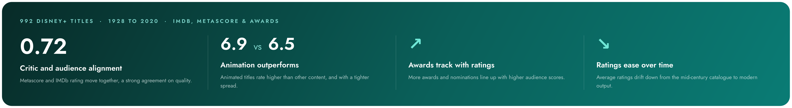
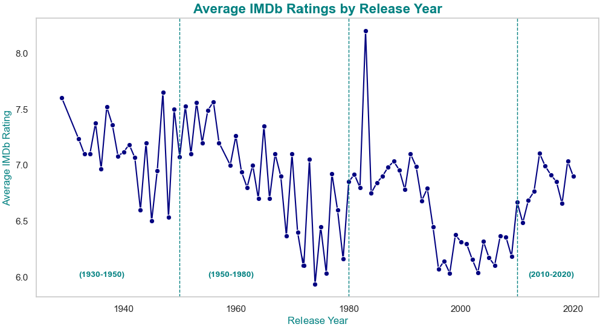
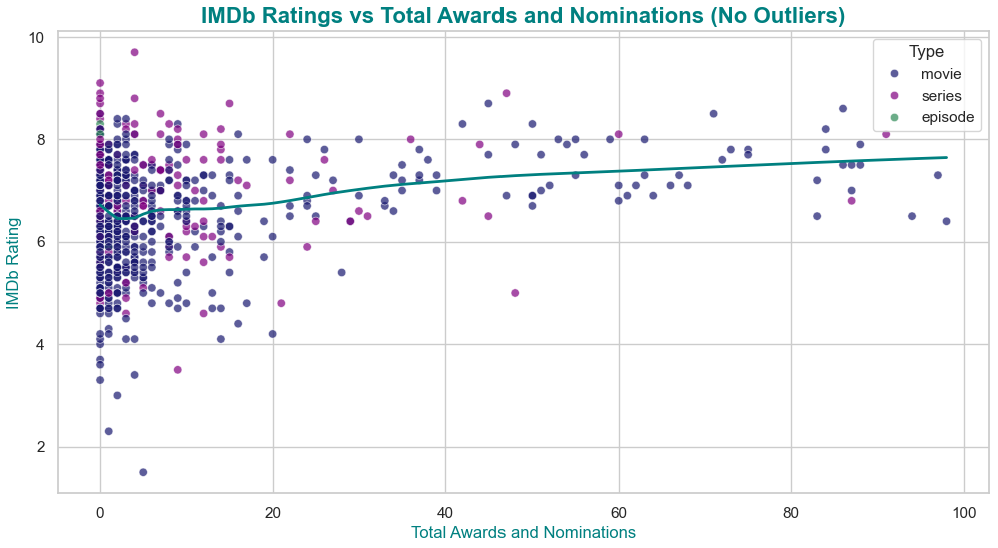

# Exploring Disney+ Content

> What content strategies drive higher IMDb ratings and critical acclaim on Disney+? An analysis of **992 titles** spanning 1928 to 2020, built for content strategists who decide what to greenlight next.


Disney's library is vast, but not every title lands the same way with audiences or critics. This project digs into the Disney+ catalog to find the patterns behind the highest-rated, most-awarded content, and turns them into recommendations a production team can act on.



The full written analysis is in [Disney-Plus-Final-Report.pdf](Disney-Plus-Final-Report.pdf).

## The data

| | |
|---|---|
| **Primary dataset** | Disney Plus Movies and TV Shows (Kaggle), 992 titles, 19 fields |
| **Supplementary** | Box Office Mojo worldwide box office data |
| **Content mix** | 680 movies, 191 series, 23 episodes |
| **Coverage** | IMDb ratings on 879 of 992 titles, Metascores on 292 |
| **Fields** | ratings, Metascore, awards, genre, runtime, language, country, plot, and more |

## What we explored

The central question broke down into four lines of inquiry: how IMDb ratings move with **type, release year, runtime, and critic scores**; how **awards and nominations** relate to ratings; whether **language and country diversity** lift ratings; and how **plot sentiment and box office** track with reception.

## A few of the findings

Audience ratings have drifted down from Disney's mid-century catalog toward its modern output, with a wide spread year to year.



More awards and nominations track with higher ratings. The relationship is clear once you look past the cluster of low-recognition titles, and it holds across both movies and series.



## What the analysis shows

1. **Animation outperforms.** Animated titles average an IMDb rating of 6.9 versus 6.5 for everything else, and with a tighter spread (standard deviation 0.86 vs 1.09), so they rate both higher and more consistently. This is where Disney's core strength sits.
2. **Awards and critical acclaim align with higher ratings.** Titles with more awards and nominations tend to score better with audiences, and the relationship holds across both movies and series.
3. **Critics and audiences mostly agree.** Metascore and IMDb rating correlate at **0.72**, a strong alignment in how the two groups perceive quality.
4. **Ratings ease over time.** Average IMDb ratings drift down from Disney's mid-century catalogue toward its modern output, with a wide spread year to year.
5. **Diversity of language and country shows no consistent rating effect.** A handful of multilingual or multi-country titles rate highly, but there is no clear overall relationship.

Alongside this, my teammate's plot-sentiment analysis (using TextBlob) found that titles with balanced sentiment tended to score best.

## My role

This was a two-person project, and I owned the data foundation and a large share of the analysis. My work covered:

- **Cleaning and preparation:** resolving missing values across ratings, votes, and release dates, standardizing data types, and validating the final dataset.
- **Feature engineering:** building the derived columns the analysis ran on, including release month and year, runtime in minutes, total awards and nominations, language count, country count, genre count, and an animation-versus-other classifier.
- **Exploratory analysis:** the IMDb ratings questions (type, release year, month, runtime), the awards and nominations relationship, the animation-versus-other comparison, and the diversity analysis across languages and countries.

**Team:** Monica Martin and Margaret Lubega.

## Repository contents

```
disney-plus-content-analysis/
├── README.md
├── disney-plus-analysis.ipynb     full analysis notebook
├── Disney-Plus-Final-Report.pdf   polished team report (13 pages)
├── disney_plus_shows.csv          primary Kaggle dataset (992 titles)
├── disney_boxoffice.csv           Box Office Mojo supplement
├── Disney_Plus_Picture.jpeg       notebook header image
└── images/
    ├── findings-at-a-glance.png
    ├── imdb-ratings-by-year.png
    └── imdb-vs-awards.png
```

The notebook reads `disney_plus_shows.csv` from the repository root, so it runs as-is once cloned.

## Tech and methods

Python, pandas, NumPy, matplotlib, seaborn, and Jupyter for the cleaning, feature engineering, and visual analysis. The wider project also used plotly and TextBlob for the sentiment work.

## A note on the data

The primary dataset is the public Disney Plus Movies and TV Shows dataset from Kaggle (992 titles), with worldwide box office figures from Box Office Mojo. Both are included here for reproducibility under their original terms; anyone reusing this work should review the source licences.

---

UC Berkeley, Master of Information and Data Science. DATASCI 200: Introduction to Data Science Programming.
